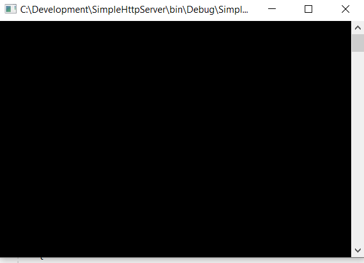
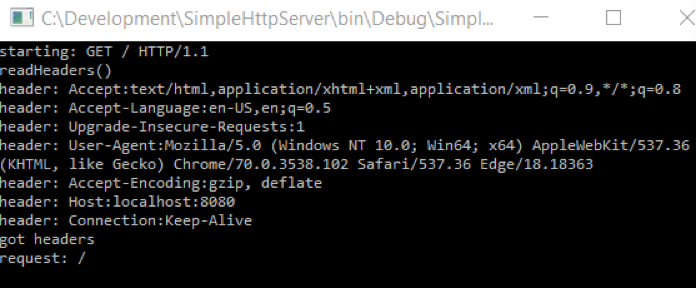
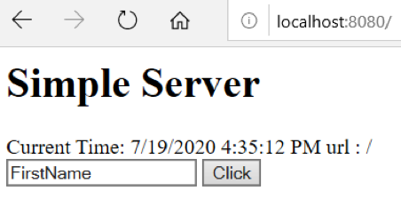
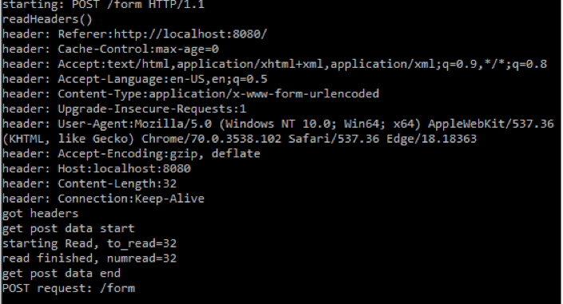

## Simple Server

Brief Description

## Getting Started	

Load the SimpleHttpServer Solution in Visual Studio, I am using 2019 Community.

Build and Run the application in debug mode:



This produces a blank window screen which represents our server waiting for a request from the client.

Enter this Url in any Browser:     http://localhost:8080



Two things happen, first the window now displays the details from your HTTP request including the Type: “Get”, HTTP version: 1.1, some browser details via headers including the host: localhost, followed by the server port which you typed in as 8080.  Also, your browser now shows a rendered page similar to:


Enter your name, replacing “FirstName” and press the Click button.

Two more things happen. The click triggers a Post process in the server which updates the window now showing HTTP “Post” Type details. 
The post process includes a simple update to the browser showing the results of what your input has produced:
```
postbody: 
FirstName=Peter&ClickValue=Click
```



From here you can click “return” to redisplay the original page and try again.

This completes the demonstration of a Simple Http Web Server. 

