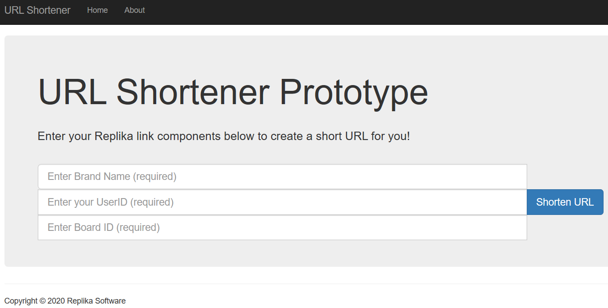

## Simple Server & URL Shortener

This repo contains a basic server and URL shortener. Below are their requirements and steps on how to run each.

## Getting Started	

Requirements for running the Simple HTTP Web Server are:
- [Visual Studio 2019](https://visualstudio.microsoft.com/downloads/)
- [.NET Framework 4.7.2.](https://dotnet.microsoft.com/download/dotnet-framework/net472)

Requirements for running the URLShortener are:
- [Visual Studio 2019](https://visualstudio.microsoft.com/downloads/)
- [.NET Core SDK 2.1](https://dotnet.microsoft.com/download/dotnet-core/thank-you/sdk-2.1.808-windows-x64-installer)

## Demonstration of a Simple HTTP Web Server

Load the SimpleHttpServer Solution in Visual Studio, I am using 2019 Community.

Build and Run the application in debug mode:


This produces a blank window screen which represents our server waiting for a request from the client.

Enter this URL in any Browser:     http://localhost:8080

Two things happen, first the window now displays the details from your HTTP request including the Type: “Get”, HTTP version: 1.1, some browser details via headers including the host: localhost, followed by the server port which you typed in as 8080.  Also, your browser now shows a rendered page similar to:


Enter your name, replacing “FirstName” and press the Click button.

Two more things happen. The click triggers a Post process in the server which updates the window now showing HTTP “Post” Type details. 
The post process includes a simple update to the browser showing the results of what your input has produced:
```
postbody: 
FirstName=Peter&ClickValue=Click
```


From here you can click “return” to redisplay the original page and try again.

This completes the demonstration of a Simple Http Web Server. 

## Demonstration of PRD Test Requirements for URL Shortener   

Load the UrlShortener Solution in Visual Studio, I am using 2019 Community.

Build and Run the application in Visual Studio. A new page should open in your default browser as below:



Please enter the 3 required fields and click the blue button to “Shorten URL”.

A new page will be displayed with the key data lines shown below:


Click the second link, the Short URL. This will redirect you to a page whose actual URL value will be the Original URL. 

This completes the demonstration of the URL Shortener. 

